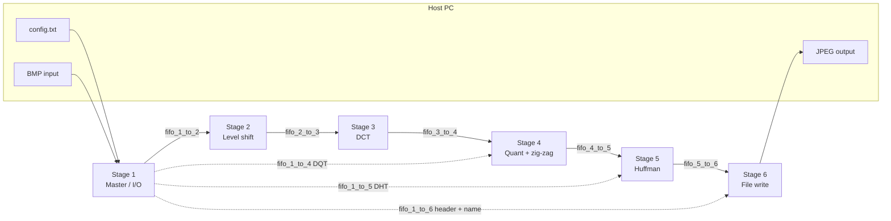

# MPSoC JPEG Encoder

**A six-core Nios II pipeline on FPGA for JPEG encoding — hardware FIFO interconnect, HostFS I/O, and optional custom-instruction accelerators.**

 

---

## Table of contents

1. [Overview](#overview)
2. [System architecture](#system-architecture)
3. [Hardware platform](#hardware-platform)
4. [RTL implementation (concrete map)](#rtl-implementation-concrete-map)
5. [Software architecture](#software-architecture)
6. [Software implementation (concrete map)](#software-implementation-concrete-map)
7. [Pipeline stages (functional view)](#pipeline-stages-functional-view)
8. [Interconnect and data planes](#interconnect-and-data-planes)
9. [Design techniques and trade-offs](#design-techniques-and-trade-offs)
10. [Part 2: hardware acceleration](#part-2-hardware-acceleration)
11. [Benchmarks and observations](#benchmarks-and-observations)
12. [Repository layout](#repository-layout)
13. [Build, program, and run](#build-program-and-run)
14. [Troubleshooting](#troubleshooting)
15. [References and documentation](#references-and-documentation)
16. [Authors](#authors)

---

## Overview

This project implements a **multiprocessor system-on-chip (MPSoC)** for **JPEG baseline encoding**. Work was carried out on a Windows host using **Intel Quartus II 13.1 Web Edition**, targeting the **Terasic DE2-115** board (**Altera Cyclone IV EP4CE115**, **50 MHz** system clock).

The design splits the encoder into **six independent Nios II/e cores**, each bound to **dedicated on-chip memory**, connected by **hardware FIFOs**. That yields a **linear pipeline** where different JPEG stages can overlap on successive 8×8 MCUs (block-level pipelining).

**Part 1** delivers a full pipelined encoder with software-optimized fixed-point math. **Part 2** improves throughput using **custom instructions**: a **combinatorial RGB→YCbCr** accelerator on Stage 1 and a **multi-cycle DCT** accelerator on Stage 3, mapped to FPGA DSP blocks.

---

## System architecture

High-level structure: **six CPUs**, **six private memories**, **five main pipeline FIFOs**, **three sideband FIFOs** for configuration, plus **timers** and **JTAG UARTs** per core.

---

## Hardware platform

| Item | Specification |
|------|----------------|
| Board | Terasic **DE2-115** |
| FPGA | **Cyclone IV** (EP4CE115 family) |
| System clock | **50 MHz** |
| CPUs | **6 × Nios II/e** (`cpu_1` … `cpu_6`) |
| Caches | Instruction/data caches **disabled** (0 B) |
| HW multiply/divide | Typically **disabled** on `/e` (math in software unless using CIs) |
| Branch prediction | **None** |
| Inter-core links | **Avalon-ST FIFOs** (32-bit words), dedicated per link |
| Peripherals | **6 × Interval Timer**, **6 × JTAG UART** |
| Host interface | **JTAG + Altera Host File System** for BMP read / JPEG write |

### On-chip memory (per stage)

Distributed **on-chip RAM** avoids a single shared SDRAM bus and reduces contention. Sizes below are taken from the **synthesized `altsyncram` parameters** in `hardware/MPSoC/synthesis/submodules/MPSoC_mem_*.v` (32-bit word-organized RAM; **bytes = 4 × numwords**).

| Memory | `numwords_a` | Size (bytes) | Stage role (summary) |
|--------|----------------:|-------------:|----------------------|
| `mem_1` | 26,000 | **104,000** | Stage 1 — config, BMP I/O, headers |
| `mem_2` | 8,000 | **32,000** | Stage 2 — level shift |
| `mem_3` | 14,000 | **56,000** | Stage 3 — DCT |
| `mem_4` | 12,000 | **48,000** | Stage 4 — quantize + zig-zag |
| `mem_5` | 12,000 | **48,000** | Stage 5 — Huffman |
| `mem_6` | 20,250 | **81,000** | Stage 6 — bitstream assembly, file write |

### FIFO parameters

| Parameter | Value in this build |
|-----------|---------------------|
| Word width | **32 bits** |

**Depth by link (from `lpm_numwords` inside the dual-clock FIFO submodule):** Qsys generates **two** FIFO wrapper types only; each logical link is an instance of one of them:

| Depth | Wrapper module | Logical FIFO instances |
|------:|----------------|-------------------------|
| **1024** × 32-bit | `MPSoC_fifo_1_to_2` | `fifo_1_to_2`, `fifo_5_to_6` |
| **256** × 32-bit | `MPSoC_fifo_3_to_4` | `fifo_2_to_3`, `fifo_3_to_4`, `fifo_4_to_5`, `fifo_1_to_4`, `fifo_1_to_5`, `fifo_1_to_6` |

So the **pipeline edges** feeding Stage 2 and draining Stage 5 use the **deeper** buffer; the **steady-rate middle** and **all sideband** FIFOs share the **256-word** implementation — exactly the “widen first and last FIFO” idea from the lab report, implemented as two shared RTL templates.

Synthesized RTL for the SoC lives under `hardware/MPSoC/synthesis/` (`MPSoC.v` top, `submodules/` for CPUs, memories, FIFOs, **Merlin** `mm_interconnect_*` Avalon-MM fabric, **irq_mapper_*** glue).

---

## RTL implementation (concrete map)

The Qsys **HTML** export is a good block diagram but hides **instance reuse**, **reset domains**, and **CI wiring**. These details are explicit in **`hardware/MPSoC/synthesis/MPSoC.v`** (generated **2026-03-27**, ACDS **13.1**).

### One Avalon-MM interconnect per CPU

Each `cpu_k` has a **private** `mm_interconnect_k` connecting only that core’s instruction/data masters to its **local** slaves: `mem_k`, `jtag_uart_k`, `timer_k`, `sysid_k`, the **FIFO ports** on that side of each bridge, and the **JTAG debug** slave. There is **no shared global bus** between application CPUs — only **FIFOs** (and JTAG debug) couple the stages.

### Reset and clocking

- **Single clock** `clk_clk` (50 MHz) feeds all logic; FIFOs are **dual-clock** wrappers but both clocks are tied to the same `clk_clk` in this design.
- Each CPU sits behind its own **`rst_controller_k`**: reset/reset_req fan out to that CPU’s `mem_k`, its interconnect, and the FIFO **wr** or **rd** side it owns. That makes it clear which reset domain owns which FIFO port.

### IRQ fan-in

`irq_mapper` blocks consolidate **JTAG UART**, **timer**, and **FIFO CSR** (`almost_full` / status) interrupts onto each CPU’s `d_irq`. You can trace exact `receiver*_irq` lines in `MPSoC.v` (e.g. `fifo_1_to_2` write-side IRQ → `cpu_1`, read-side → `cpu_2`).

### Custom instructions (actual port names)

| CPU | CI type | RTL hookup | Module |
|-----|---------|------------|--------|
| `cpu_1` | **Combinatorial** | `comb_slave_translator0` → **`rgb_to_ycbcr_ci_0`** | `synthesis/submodules/rgb_to_ycbcr_ci.v` — packed RGB in `dataa[23:0]`, packed **Y/Cb/Cr** bytes in `result` |
| `cpu_3` | **Multi-cycle** | `multi_slave_translator0` → **`dct_accelerator`** (start/done/clk_en, `n[1:0]` opcode) | Also under `submodules/` in synthesis; source copy: `hardware/Accelerators/dct_accelerator.v` |
| `cpu_2`, `cpu_4`, `cpu_5`, `cpu_6` | None | Nios ports tied off (e.g. `cpu_2` **`no_ci_readra`**) | — |

The DCT accelerator keeps **64 × 16-bit** `block_ram` / `trans_ram` arrays inside the module and uses an FSM (**IDLE → CALC_ROW → CALC_COL → FINISH**) with **fixed-point cosine** rows selected by `loop_u` and **>>> 13** scaling — matching the lab description.

---

## Software architecture

Software is split into **six Nios II applications** (`software/stage1` … `software/stage6`), each with its own BSP and `system.h` generated from the hardware.

| Area | Role |
|------|------|
| **Stage 1** | Reads `config.txt`, parses **24-bit BMP**, RGB→YCbCr, builds MCUs, pushes **dimension packets**, **DQT**, **Huffman tables**, **filename + JPEG header** over FIFOs |
| **Stage 2** | **Level shift** `block[i] -= 128` per component; forwards dimensions |
| **Stage 3** | **2D DCT** — in this tree, `dct.c` drives the **`dct_accelerator`** custom instruction (load 64 samples → compute → read back); a pure-software DCT is not used in the checked-in build |
| **Stage 4** | **Quantization** + **zig-zag** reorder using tables from Stage 1 |
| **Stage 5** | **DC diff**, **RLE**, **Huffman**, **byte stuffing**, packs to **16-bit FIFO words**; ends scan with **EOI** pattern and handshake |
| **Stage 6** | Merges **header** (from Stage 1) and **bitstream** (from Stage 5); detects **0xFFD9** then **0xAAAA** sentinel; writes **`.jpg`** via HostFS |

Shared-style helpers and types appear under each stage’s `nios2_common/` (e.g. `fifo_io`, `datatype`).

Key source files (illustrative):

- Stage 1: `encoder.h` / `encoder.c`, `main.c`, `huffdata.c` / `huffdata.h`, `huffman.c` (`init_chroma_ac_tables`), optional `readYUV.c`
- Stage 2: `levelshift.c`, `main.c`
- Stage 3: `dct.c`, `main.c`
- Stage 4: `quant.c`, `quantdata.c` / `quantdata.h`, `main.c`
- Stage 5: `huffman.c`, `huffdata.c` / `huffdata.h`, `markdata.c`, `main.c`
- Stage 6: `main.c` only (single compilation unit for app logic)

---

## Software implementation

This section matches **what is in the tree**, not a generic JPEG lecture: entry points, **`system.h` symbols**, FIFO directions, and how data is framed on the wire.

### Project layout and BSP

| Path | Purpose |
|------|---------|
| `software/stage1` … `stage6` | Six **independent** Nios II **application** projects (each expects its own BSP with `system.h` defining `FIFO_*_BASE` / `*_CSR_BASE`, timers, etc.) |
| `software/stage*/nios2_common/` | Per-stage copies of **`fifo_io`**, **`datatype.h`**, **`jdatatype.h`**, **`config.h`** — same API, duplicated so each Eclipse project builds standalone |

The BSP **`system.h`** is **not** committed here; it is generated when you point the BSP at the **`.sopcinfo`** / Qsys export that matches `hardware/MPSoC`. All FIFO macros used below come from that generated header.

### FIFO access layer (`nios2_common/fifo_io.c`)

- **`fifo_init(csr)`** — clears the Altera Avalon FIFO **event** register (`IOWR_ALTERA_AVALON_FIFO_EVENT`).
- **`fifo_read_block` / `fifo_write_block`** — **blocking** polls: spin on **STATUS** empty (read) or full (write), then transfer one **16-bit** sample at a time via `IORD`/`IOWR` on the FIFO **data** port (`INT16` buffers in C).

A **`#else`** branch provides **mock** `printf` stubs for host-GCC unit tests (no Nios defines).

### Per-stage `main.c`: which `FIFO_*` macro connects where

Each stage defines **local aliases** at the top of `main.c` so the data path reads like a pipeline. Names follow Qsys: **`*_OUT_*`** is the CPU **read** side of the upstream link; **`*_IN_*`** is the **write** side to downstream.

| Stage | Read from (upstream) | Write to (downstream) | Sideband from Stage 1 |
|------:|----------------------|------------------------|-------------------------|
| **1** | — (HostFS) | `FIFO_1_TO_2_IN_*` (data), `FIFO_1_TO_4_IN_*`, `FIFO_1_TO_5_IN_*`, `FIFO_1_TO_6_IN_*` | — |
| **2** | `FIFO_1_TO_2_OUT_*` | `FIFO_2_TO_3_IN_*` | — |
| **3** | `FIFO_2_TO_3_OUT_*` | `FIFO_3_TO_4_IN_*` | — |
| **4** | `FIFO_3_TO_4_OUT_*`, `FIFO_1_TO_4_OUT_*` | `FIFO_4_TO_5_IN_*` | DQT: 64 + 64 halfwords |
| **5** | `FIFO_4_TO_5_OUT_*`, `FIFO_1_TO_5_OUT_*` | `FIFO_5_TO_6_IN_*` | DHT tables (DC/AC code + size arrays) |
| **6** | `FIFO_1_TO_6_OUT_*`, `FIFO_5_TO_6_OUT_*` | — (HostFS `fopen`/`fwrite`) | Filename, header length + bytes |

Stage 1’s `main.c` uses the same physical ports via aliases: `FIFO_OUT_BASE` → `FIFO_1_TO_2_IN_BASE`, `FIFO_OUT_TO_4_BASE` → `FIFO_1_TO_4_IN_BASE`, etc.

### Stream framing

1. **Per image (order matters)**  
   - Stage 1 pushes **sideband first**: output **filename** (length + chars) and **623-byte JPEG header** (via `send_dynamic_header`) on `fifo_1_to_6`; **128** quantizer halfwords on `fifo_1_to_4`; **Huffman** tables on `fifo_1_to_5` (`send_dht_to_stage5` — eight table segments).  
   - Then **main data**: a **2-word dimension packet** (`width`, `height`) on `fifo_1_to_2`, followed by **per MCU**: three blocks of **64 × `INT16`** (Y, Cb, Cr).

2. **Stages 2–4** — read the dimension pair, **forward it unchanged** on the outgoing FIFO, then loop **`total_mcus`** times with **192 halfwords** in (or out) per MCU unless noted.

3. **Stage 5** — receives DHT from sideband, then dimensions from the main link; **resets DC predictors** (`prev_dc_y/cb/cr`) each image; variable **`huffman_encode_block` / `huffman_flush`** output length; writes **packed halfwords** to Stage 6. **End of scan**: writes literal halfwords **`0xFFD9`** then **`0xAAAA`** as a handshake (see `stream_buffer` in `main.c`).

4. **Stage 6** — reads filename + header from **`fifo_1_to_6`**, then bitstream from **`fifo_5_to_6`** until **`prev_word == 0xFFD9`** and **current word == 0xAAAA`**; appends final **FF D9** bytes to the buffer and **`fwrite`** the file. **`global_write_buffer`** is **8 KB** (`MAX_FILE_SIZE`); **`stream_buffer`** in Stage 5 is **256** halfwords (global to avoid stack overflow).

### Stage-by-stage source highlights

| Dir | Core files | Behavior (from code) |
|-----|------------|----------------------|
| **stage1** | `main.c` | Batch: `fopen("/mnt/host/files/config.txt")` — line 1 **`num_images`**, then triplets **input path, output path, quality**. BMP-only path validates **`bpp == 24`**. Scales Q tables (`global_scaled_q_luma/chroma`), `init_chroma_ac_tables()`, dispatches sideband + dimensions, then **fast path** (`width,height <= 32`) using **`global_full_image_buffer`** or **MCU path** with **`global_mcu_buffer`** + `encode_mcu_row(..., 8, 1, ...)`. Ends with **`while(1)`** after batch (master does not loop forever silently). |
| | `encoder.c` | **`ALT_CI_RGB_TO_YCBCR_CI_0`** on packed `0x00RRGGBB`-style word; writes three **64-sample** blocks per MCU to FIFO. |
| **stage2** | `levelshift.c` | `block[i] -= 128` for 64 taps. |
| **stage3** | `dct.c` | **`ALT_CI_DCT_ACCELERATOR`**: opcode **0** = write sample index + value, **1** = start compute, **2** = read coefficient index (see `CMD_*` in file). |
| **stage4** | `quant.c` | Sign-aware divide with rounding; output indexed by **`zigzag_table[]`** from `quantdata.h`. |
| **stage5** | `huffman.c` | DC diff, AC RLE, bit accumulation, **byte stuffing** in bitstream helpers; flushes to **`stream_buffer`**. |
| **stage6** | `main.c` | Two FIFO sources merged into **`global_write_buffer`**; output path is whatever string Stage 1 sent (HostFS path). |

### Benchmarking in firmware

Stages **2–6** wrap the inner loop with **`alt_timestamp_start()`** / **`alt_timestamp()`** and print **cycles**, **ms**, and a rough **throughput** figure on the JTAG UART. Interpretation matches the lab report: mid-pipeline stages can show long “active” times when **blocked on FIFO full/empty**, not only when computing.

---

## Pipeline stages

### Stage 1 — Master controller

- Batch jobs from **`config.txt`**: input path, output path, **quality factor**
- **BMP** parsing: width, height, bpp, pixel offset; **24-bit path** enforced
- **Quality → scaled luma/chroma quantization tables**; canonical **Huffman** tables initialized
- **Sideband**: DQT → Stage 4, DHT → Stage 5, **623-byte header** + output filename → Stage 6
- **Data plane**: BGR→RGB, optional strip/full buffer for small images, **MCU streaming** for large images; **RGB→YCbCr** to three **INT16** 8×8 blocks (Y, Cb, Cr) per MCU

### Stage 2 — Level shift

- Input: dimension word pair, then per-MCU **Y, Cb, Cr** blocks
- **Subtract 128** from all 64 samples per component
- Forwards dimensions to Stage 3

### Stage 3 — DCT

- In this repository, **`dct.c`** implements the transform via the **`dct_accelerator`** custom instruction (write 64 samples, trigger compute, read 64 coefficients) — see [Software implementation (concrete map)](#software-implementation-concrete-map).
- Stream structure unchanged: 64 coefficients per block, MCU-major

### Stage 4 — Quantization and zig-zag

- Loads **128** quantizer values (64 luma + 64 chroma) from Stage 1 at image start
- Sign-aware **division/rounding**; **zig-zag** output order for entropy coding

### Stage 5 — Entropy coding

- Resets **DC predictors** per image
- DC: diff + **VLI**; AC: **RLE**, **ZRL** for long zero runs, **EOB**
- **JPEG byte stuffing** (`0xFF` → `0xFF 0x00`); packs bytes into **16-bit** words to FIFO
- Termination: compressed stream ends with **EOI** semantics plus **0xAAAA** handshake for Stage 6

### Stage 6 — JPEG assembly and write

- Consumes **filename**, **header bytes**, then **payload words** from Stage 5
- Detects **previous word 0xFFD9** and **current 0xAAAA** to close the stream
- Writes final **.jpg** through HostFS

---

## Interconnect and data planes

- **Main pipeline**: strictly **fifo_1_to_2 → … → fifo_5_to_6** for MCU/coefficient streams.
- **Control sideband**: **fifo_1_to_4**, **fifo_1_to_5**, **fifo_1_to_6** for tables, header, and filename — **no shared memory** between CPUs for application data.

This repository’s Stage 1 code maps these links to symbols such as `FIFO_1_TO_2`, `FIFO_1_TO_4`, `FIFO_1_TO_5`, `FIFO_1_TO_6` (see `software/stage1/main.c`).

---

## Design techniques and trade-offs

| Technique | Outcome |
|-----------|---------|
| **Static buffers** (`global_strip_buffer`, `global_full_image_buffer`, `global_mcu_buffer`) | Avoids **heap fragmentation** and `malloc` failures on small OCM |
| **MCU-by-MCU streaming** for large images | Bounded RAM; trades speed for **JTAG HostFS** read latency |
| **Fixed-point** throughout | Essential without FPU; avoids slow float emulation on Nios II/e |
| **Fast DCT** (separable 1D) | Reduces complexity vs naive 2D nested loops |
| **`config.txt` instead of scanf** | Avoids JTAG UART **CR/LF** issues and saves stack |
| **Batch loop** over multiple images | Automated benchmarks without manual reset |
| **Dimension packet daisy-chain** | Resolution-agnostic stages; consistent MCU counts |
| **Dynamic Q scaling** | Single base table scaled by quality; DQT sent per image |

### Bottlenecks

- **JTAG HostFS** limits both **Stage 1 read** (large images, chunked `fread`) and **Stage 6 write**.
- For small images with fast-path buffers, **backpressure** can make mid-pipeline stages **wait on FIFO drain** dominated by Stage 6.
- **Wider edge FIFOs** (e.g. 1024 words on `fifo_1_to_2` / `fifo_5_to_6`) improve **decoupling** and reduce micro-stalls but rarely change **end-to-end** time when I/O bound.

---

## Part 2: hardware acceleration

### 1. Custom instruction: RGB → YCbCr

- **Combinatorial** (single-cycle style) CI: pack **R,G,B** into one 32-bit operand
- Same **fixed-point** coefficients as C; mapped to **DSP** multipliers
- Software name (report): `rgb_to_ycbcr_ci` — large **Stage 1** speedups on in-memory fast path (e.g. **32×32** dispatch time drops dramatically vs pure software loops)

### 2. Multi-cycle custom instruction: DCT

- **FSM** states (e.g. IDLE, row pass, column pass, finish) with **internal RAM** for the 8×8 block
- **Fixed-point** cosines (e.g. scaled by 2¹³), **MAC** in DSP blocks; **arithmetic right shift** for rescaling
- CPU loads block, **starts** CI, **polls done** — removes heavy software DCT inner loops

### Resource co-design note

To fit **M9K** and accelerators, BSP options such as **small C library** may be considered for **size** — but **full** newlib is required if **standard file I/O** (`fopen`, etc.) must remain; the lab report documents this tension explicitly.

---

## Benchmarks and observations

Representative results from the lab report (exact numbers depend on image and build):

- **Baseline**: small test images on order of **seconds** end-to-end dominated by **I/O** and **FIFO backpressure**, not pure ALU time.
- **DCT CI**: roughly **10–17%** end-to-end reduction on several resolutions when CPU DCT was the hot path; **40×40** still **I/O-limited** (~10% gain).
- **RGB→YCbCr CI**: very large **Stage 1** active-time reduction on fast-path images; total time reduction tracks reduced contention (e.g. on order of **~1–2 s** for **32×32**, **~7 s** for **40×40** in reported tables).
- **Quantization**: lower **Q** → smaller files and slightly shorter runs (fewer bytes over JTAG).
- **Tiny images**: JPEG **container overhead** (~623 B header) can make **compressed file larger than raw** for **8×8** inputs.

---

## Repository layout

| Path | Contents |
|------|----------|
| `hardware/MPSoC/` | Quartus synthesis output, interconnect, CPUs, memories, FIFO wrappers |
| `software/stage[1-6]/` | Per-core Nios II C projects, BSP outputs, `nios2_common` |
| `JEnc_vlog/` | Supplementary Verilog / TIE / verification collateral (encoder-related experiments) |

---

## Build, program, and run

1. **Hardware**: Open the Quartus project for **MPSoC**, run **Analysis & Synthesis** → **Fitter** → **Assembler**; configure the FPGA on the DE2-115.
2. **Software**: For each stage, refresh BSP from the **updated `.sopcinfo` / Qsys**, then build in **Nios II SBT for Eclipse** or command-line tools.
3. **Host files**: Place **`config.txt`**, input **`.bmp`** (24-bit), and output paths on the **HostFS** root or paths referenced in `config.txt` (as used in your BSP).
4. **Run**: Download **all six** `.elf` images in multicore debug configuration (or your class workflow); observe **JTAG UART** per stage if logging is enabled.

> **Note:** Exact project file names (`.qpf` / `.qsys`) may live only on the lab machine; this repo snapshot centers on **synthesis output** and **software trees**. Point your toolchain at `hardware/MPSoC/` as the hardware handoff.

---

## Troubleshooting

| Symptom | Likely cause | Mitigation |
|---------|----------------|------------|
| Corrupted colors / stride | **32-bit BMP** or wrong bpp | Export **24-bit BMP**; validate header in Stage 1 |
| `malloc` / heap errors | OCM limits | Use **static** buffers only (as in Stage 1 globals) |
| `fopen` missing when using small lib | Small C library strips I/O | Use full lib for HostFS stages or alternate I/O |
| Garbled paths from UART | Hidden `\r`/`\n` in strings | Use **`config.txt`**, not interactive `scanf` |
| Verilog CI wrong results | Overflow / shift semantics | Use **signed** intermediates and **`>>>`** where needed |

---

## References and documentation

- **ITU-T T.81** — JPEG baseline encoding
- **Intel Quartus II / Nios II** — embedded design flow

---

README generated to reflect the Practical 4 lab report and this repository’s software/hardware layout.

